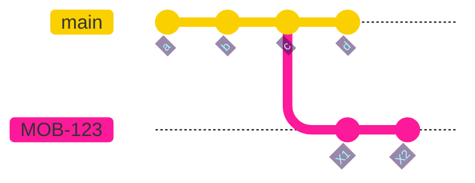
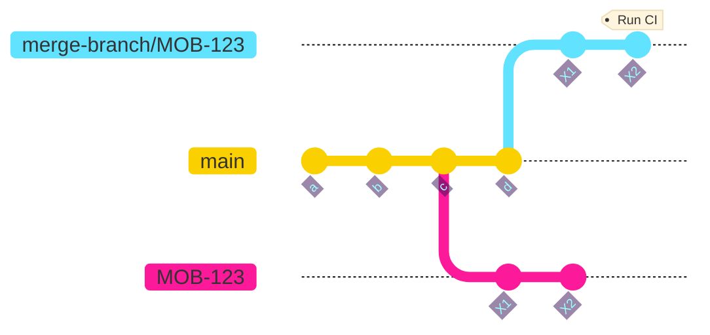
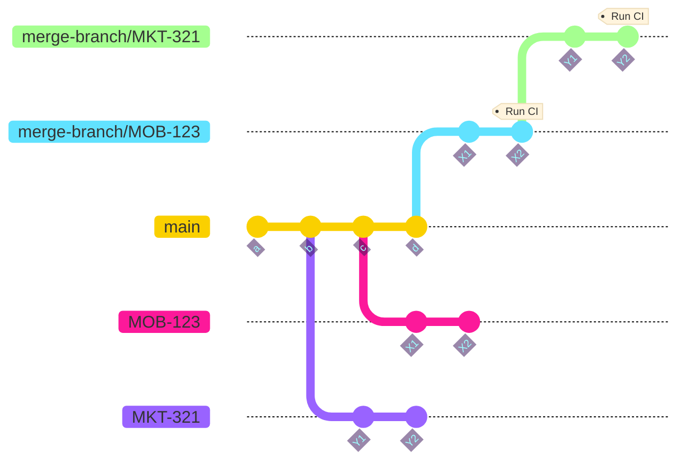
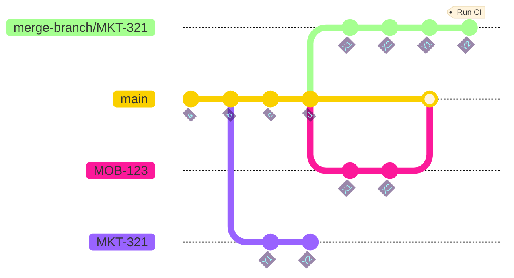
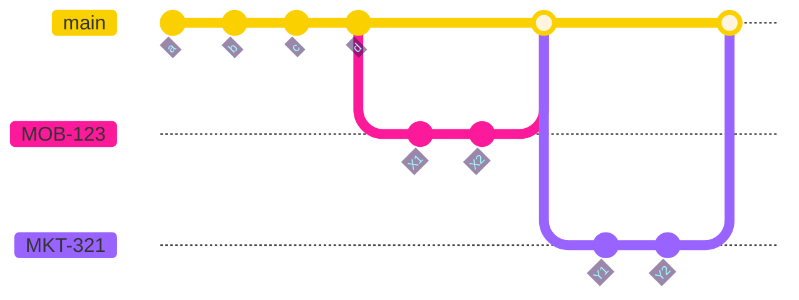

A Github workflow to ensure that all merges must pass CI against main _before_ being merged.

# Philosophy

- __Minimise latency between initiating merge and completing merge__

    Optimistically assume that all merges queued ahead will pass and run CI immediately against that outcome. We won't merge until it is confirmed that the branches ahead pass, but we can begin the checks immediately.

- __Minimal dependencies__

    The merge queue state is stored in a Git branch in the project's repo, no need for any other setup.

- __PR Branches must be rebaseable onto main__

    A rebaseable branch is always mergeable, but not necessarily the other way around. Requiring branches to be rebaseable allows us to maintain a clean main branch with consecutive merge bubbles for each PR merged.

- __All merges must be performed by this merge queue__

    Other methods should be disabled, including the "Merge" button on Github and direct pushed to `main`.

# Usage

It is assumed that CI is running on CircleCI.

1. __Add a workflow to the project repository__

    The merge should be able to be kicked off by any Pull Request event, but it has been developed and tested with the following:

    ```yaml
    # .github/workflows/merge-queue.yml

    name: Merge-Queue
    run-name: Merge-Queue

    on:
      issue_comment:
        types: [created, edited]

    jobs:
      merge:
        if: github.event.issue.pull_request && github.event.comment.body == '/merge'
        name: Merge
        runs-on: ubuntu-latest
        permissions: write-all
        steps:
          - uses: jakeprime/merge-queue@main
            env:
              ACCESS_TOKEN: ${{ secrets.ACCESS_TOKEN }}
              PR_NUMBER: ${{ github.event.issue.number }}
    ```

    This will trigger the merge when a comment of "/merge" is written on the PR.

2. __Configure CI to run merge branches__

    Merge branches will be named `merge-branch/...`. We need CI to run against these branches when they are pushed.

3. __Disable any other methods of merging or pushing to `main`__

# Demo

See it in action

<div>
  <a href="https://www.loom.com/share/6f90587106c84b21afde86b3fadfc6cf">
    
  </a>
</div>
  
# How it works

## Step by step

The merge process performs the following steps:

1. __Check that the PR is mergeable and rebaseable__

    All Gitflow actions need to have passed and the branch must be rebaseable

2. __Create merge branch__

    Find the most recent non-failing branch in the merge queue and create a new merge branch by rebasing the PR branch onto it. If there are none already in progress than `main` is used as the base. For more details see the [Branching and Merging](#branching-and-merging-strategy) section below.

4. __Wait for CI result__

    If we have failed CI we won't remove ourselves just yet. We might have failed because of a branch ahead of us, but we won't know that until we're at the front. We do know that no branch following us will be passing though, so if we've failed we'll remove all descendant branches from the queue.

5. __Wait until we're front of the queue__

    Now we know what we are. If we've failed CI then this is a failing PR and we can abort the process. If we've passed CI and there's nothing in front of us we can confidently merge.

We also regularly check our state throughout this process to see if:

- We are no longer in the queue
    This means that a branch ahead of us must have failed and we've been removed without prejudice, knowing that we would fail. We should retry.
- The PR branch SHA has changed
    We need to abort in this case, and remove all of our descendant branches from the queue so they can retry based of a branch with better prospects.

## Retrying

If we've failed without being at the front, or have been removed from the queue because a branch ahead of us has failed, then we should retry. We retry the process from the start a maximum of two more times if that is the case.

## Storing queue state

Perhaps unusually the state of the queue is stored in a Git branch in the project repository called `merge-queue-state`. It will be created if it doesn't already exit.

The state is kept in a `state.json` file, structured as so:

```json
{
  "branchCounter": 660,
  "mergeBranches": [
    {
      "name": "merge-branch/mob-541-add-client-659",
      "pr_branch": "mob/541-add-client",
      "title": "[MOB-541] Add client",
      "pr_number": "1910",
      "sha": "385e7147ec6035dd3fecb8f325346b13548f561b",
      "status": "pending",
      "count": 659,
      "ancestors": []
    },
    {
      "name": "merge-branch/mkt-321-update-metrics-660",
      "pr_branch": "mkt-321-update-metrics",
      "title": "[MKT-321] Update payment metrics",
      "pr_number": "1925",
      "sha": "7981ae63520a8ae9c1d6b0ee7ef873701ba6c24a",
      "status": "pending",
      "count": 660,
      "ancestors": ["merge-branch/mob-541-add-client-659"]
    }
  ]
}
```

The `sha` refers to the tip of the PR branch when the merge process was initiated, so we can verify that no updates have been pushed during the merge.

Each merge branch is based off the previous one so it is important to know who our ancestors are, as if any of our ancestors fail CI then so will we.

## Data integrity

Concurrent merge processes will need access to the same store, so we need to ensure there are no race conditions or overwriting. Whenever a process needs to write to the store they must get a lock first. This is a file in the `merge-queue-state` branch called `lock`. It contains the run ID of the Gituhub action.

`git push` enables us to atomically obtain a lock.

# Branching and Merging strategy

Let's take an example where there are no merges currently in the queue, and we have a PR `MOB-123` we want to merge. Our starting position will be something like this:



We'll rebase the PR branch onto main to create our merge branch, and run CI on its tip:



While CI is still running on the tip of `merge-branch/MOB-123` another PR wants to merge. This time instead of rebasing onto `main` we rebase off the latest active merge branch:




> [!IMPORTANT]
> This is safe on the condition that there are no ways to merge to `main` other than using this merge queue

Once CI has passed on the first merge branch we rebase the PR branch onto `main` and merge. The second merge branch will continue to run CI, and as illustrated below it contains exactly the commits that have been merged already followed by the ones from its PR.



> [!NOTE]
> Ideally it would be great to have CI run on the same SHA that ends up in `main`. In theory this is possible by pointing the HEAD of `main` to the tip of the merge branch. However as far as Github is concerned suddenly all the changes in the PR already exist in `main` and it will close the PR and lose all the changes it contained.

Assuming CI passes our final state will be:



# Development

## Tests

Tests are written in [Minitest](https://github.com/minitest/minitest) with the [Mocha](https://github.com/freerange/mocha) framework for stubbing.

The test are very fast, so [Guard](https://github.com/guard/guard-minitest) can be run during development to re-run tests whenever files are updated. Start it with:

```sh
bundle exec guard
```

## Running locally

The whole merge process can be executed on real Pull Requests by running the Docker image locally. Create a `.env` file with the values that would be present when it would be run in a Github action:

```
ACCESS_TOKEN=<github token with write privileges on the repo>
GITHUB_REPOSITORY=<owner/repo>
PR_NUMBER=<number of PR to be merged>
GITHUB_RUN_ID=<just need to be present, any value is fine>
GITHUB_WORKSPCE=<working folder, e.g. /tmp/merge-queue>
```

Then build and run the docker image:

```sh
docker build . --tag 'merge-queue'
docker run -t --env-file .env 'merge-queue'
```
